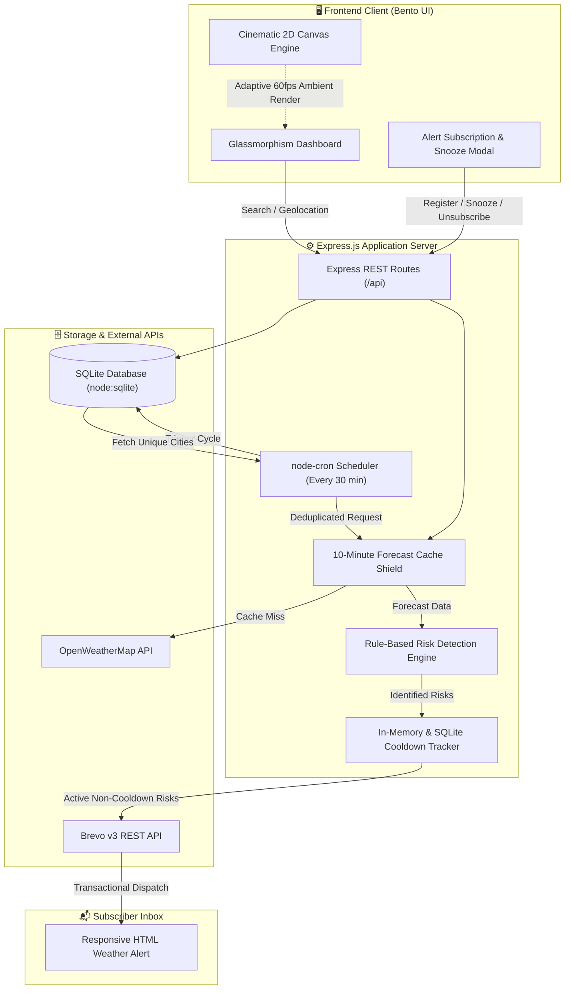

<p align="center">
  <a href="https://rohiths-weather-watch.onrender.com" target="_blank" rel="noopener noreferrer">
    
  </a>
</p>

<h1 align="center">⛅ Rohith's WeatherWatch</h1>

<p align="center">
  <strong>24/7 Autonomous Weather Monitoring, Meteorological Hazard Detection & Real-Time Brevo Email Alert System</strong>
</p>

<p align="center">
  <em>Register once. Close the browser. Get alerted with rich HTML reports the moment dangerous weather threatens your city.</em>
</p>

<p align="center">
  <a href="https://rohiths-weather-watch.onrender.com"></a>
  <a href="https://nodejs.org"></a>
  <a href="https://expressjs.com"></a>
  <a href="https://www.sqlite.org"></a>
  <a href="https://www.brevo.com"></a>
  <a href="https://openweathermap.org/api"></a>
  <a href="#-license"></a>
</p>

<p align="center">
  <a href="https://rohiths-weather-watch.onrender.com"><strong>Explore Live Dashboard »</strong></a> &nbsp;&bull;&nbsp;
  <a href="#-system-architecture"><strong>System Architecture »</strong></a> &nbsp;&bull;&nbsp;
  <a href="#-quick-start"><strong>Quick Start »</strong></a> &nbsp;&bull;&nbsp;
  <a href="#-api-reference"><strong>API Reference »</strong></a> &nbsp;&bull;&nbsp;
  <a href="#-cli-database-admin"><strong>DB Admin CLI »</strong></a>
</p>

---

## 📖 Table of Contents

- [🌟 Why WeatherWatch?](#-why-weatherwatch)
- [✨ Core Capabilities](#-core-capabilities)
- [🏗 System Architecture](#-system-architecture)
- [🔄 Autonomous Monitoring & Alert Pipeline](#-autonomous-monitoring--alert-pipeline)
- [🌡️ Meteorological Risk Engine & Thresholds](#️-meteorological-risk-engine--thresholds)
- [🎨 Cinematic 2D Canvas Weather Engine](#-cinematic-2d-canvas-weather-engine)
- [📊 Bento Grid Dashboard Experience](#-bento-grid-dashboard-experience)
- [📁 Project Directory Structure](#-project-directory-structure)
- [🔌 API Reference](#-api-reference)
- [🗄️ Database Architecture & CLI Admin](#️-database-architecture--cli-admin)
- [⚙️ Quick Start & Installation](#️-quick-start--installation)
- [🧪 Testing & Operational Commands](#-testing--operational-commands)
- [🌐 Production Deployment](#-production-deployment)
- [🛡️ Performance, Reliability & Security](#️-performance-reliability--security)
- [🤝 Contributing](#-contributing)
- [📄 License & Credits](#-license--credits)

---

## 🌟 Why WeatherWatch?

Most weather applications are **passive**: you have to open the app, search your city, and read forecasts before you notice an incoming storm or heatwave. 

**WeatherWatch transforms weather tracking from passive to proactive.** It operates as an autonomous background sentinel:

1. **Zero Frontend Dependency**: A registered subscriber does not need to keep the tab open. The backend monitoring engine runs 24/7 on an automated cron schedule.
2. **Predictive Risk Modeling**: Analyzes upcoming 24-hour meteorological trends (precipitation probability, ambient temperature, wind velocity, and storm classifications) to predict hazards before they strike.
3. **Anti-Spam Intelligence**: Combines custom notification preferences, a persistent 3-hour per-risk cooldown mechanism, and snooze controls to guarantee alerts remain actionable and spam-free.
4. **Actionable HTML Dispatches**: Emails delivered through Brevo API v3 include real-time atmospheric metrics, severity badges, localized impact descriptions, and targeted safety checklists.

---

## ✨ Core Capabilities

| Capability | Technical Details |
|---|---|
| **🛡️ 24/7 Background Sentinel** | Continuous automated monitoring via `node-cron` with zero client-side dependencies. |
| **⚡ Intelligent City Deduplication & Cache** | Multiple users in the same city trigger only **one** weather fetch; 10-minute in-memory cache shields external API quotas. |
| **🧠 Multi-Factor Risk Engine** | Evaluates 24-hour forecast windows for heavy rain ($\ge 70\%$), extreme heat ($\ge 40^\circ\text{C}$), gale winds ($\ge 50\text{ km/h}$), and thunderstorms. |
| **📧 Transactional Brevo HTML Alerts** | Responsive, styled email templates with live metric grids, active warning callouts, safety checklists, and direct console link. |
| **🔕 Anti-Spam Cooldown & Snooze** | Per-user, per-city, per-risk cooldown window (default: 3 hours) and flexible temporary snooze (1h, 4h, 8h, 24h, custom). |
| **🎨 Cinematic Procedural Canvas** | 6-layer procedural environment rendering 24 time/weather palettes with adaptive hardware performance tiers. |
| **📱 Glassmorphism Bento Grid** | Responsive modern UI featuring a live 5-tier risk badge, 24-hour hourly forecast strip, and 5-day daily forecast outlook. |
| **📍 Dual Geolocation Resolution** | Instant city text search with autocomplete memory + GPS device geolocation with fallback to IP-based location (`ipwho.is`). |
| **🗄️ Native Zero-Setup SQLite** | Uses Node.js 22+ built-in `node:sqlite` (`DatabaseSync`) with WAL mode and cascade deletes — no native build tools required. |
| **🛠️ Database Admin CLI Tool** | Interactive terminal tool (`backend/dbAdmin.js`) to inspect tables, query records, view schemas, and manage database state. |

---

## 🏗 System Architecture



---

## 🔄 Autonomous Monitoring & Alert Pipeline

The core operational cycle runs completely autonomously on the backend server:

```
[ node-cron triggers cycle (default: every 30m) ]
                       │
                       ▼
 [ Query unique cities from registered users (SQLite) ]
                       │
                       ▼
      [ Fetch 5-day / 3-hour forecast for each unique city ]
        ├── Checks 10-minute in-memory cache
        └── Fetches from OpenWeatherMap only on cache miss (prevents rate limits)
                       │
                       ▼
       [ Evaluate 24-hour forecast window (8 × 3h blocks) ]
        ├── Rain Probability >= RISK_RAIN_PROBABILITY (70%)
        ├── Ambient Temp     >= RISK_HIGH_TEMPERATURE (40°C)
        ├── Wind Velocity    >= RISK_STRONG_WIND (50 km/h)
        └── Weather Condition === 'Thunderstorm'
                       │
                       ▼
       [ Are any risks detected for this city? ]
        ├── NO  ──> Log normal conditions, finish city check.
        └── YES ──> Identify all users subscribed to this city.
                       │
                       ▼
          [ For each subscriber in city: ]
        ├── Check Snooze status: if active -> SKIP
        ├── Match detected hazards against user preferences: if none match -> SKIP
        ├── Check 3-hour cooldown (SQLite alert_history + RAM cache): if active -> SKIP
        └── Dispatch rich HTML alert via Brevo REST API v3
                       │
                       ▼
 [ Record alert timestamp in alert_history (Enforces cooldown) ]
```

---

## 🌡️ Meteorological Risk Engine & Thresholds

WeatherWatch continuously runs raw meteorological data through a dedicated rule-based evaluation engine ([riskDetection.js](backend/services/riskDetection.js)). All thresholds are configurable through environment variables:

| Hazard Category | Default Threshold | `.env` Key | Severity Classification |
|---|---|---|---|
| 🌧️ **Heavy Rain** | $\ge 70\%$ probability | `RISK_RAIN_PROBABILITY` | Moderate ($\ge 70\%$) &bull; Severe ($\ge 85\%$) |
| 🔥 **Extreme Heat** | $\ge 40.0^\circ\text{C}$ | `RISK_HIGH_TEMPERATURE` | Moderate ($\ge 40^\circ\text{C}$) |
| 💨 **Gale Winds** | $\ge 50.0\text{ km/h}$ | `RISK_STRONG_WIND` | Moderate ($\ge 50\text{ km/h}$) |
| ⚡ **Thunderstorm** | Meteorological condition code | *Automatic* | **Severe** (Immediate alert regardless of numbers) |

### Overall Threat Level Determination

The application calculates a synthesized threat badge displayed prominently on the dashboard and included in email headers:

- 🟢 **Clear (`none`)**: No adverse weather criteria met.
- 🟡 **Low (`low`)**: Minor single condition detected.
- 🟠 **Moderate (`moderate`)**: High heat, elevated wind, or moderate rainfall predicted.
- 🔴 **High (`high`)**: Multiple concurrent weather hazards within 24 hours.
- 🚨 **Severe (`severe`)**: Thunderstorms or extreme precipitation ($\ge 85\%$), or $\ge 3$ simultaneous hazards.

---

## 🎨 Cinematic 2D Canvas Weather Engine

The frontend is powered by a custom GPU-accelerated HTML5 Canvas pipeline ([weatherBackground.js](frontend/JS/weatherBackground.js)) rendering a 6-layer atmospheric backdrop:

```
[Layer 1: Sky]        4-Stop HDR Gradient (Day / Dawn / Dusk / Night)
        ↓
[Layer 2: Stars/Moon] Twinkling starfield + Procedural crescent moon
        ↓
[Layer 3: Lighting]   Sun disc, atmospheric god-rays & storm vignettes
        ↓
[Layer 4: Clouds]     3-depth volumetric clouds with zenith rim highlights
        ↓
[Layer 5: Particles]  Depth-split rain streaks / 4-class snow / sun motes
        ↓
[Layer 6: Atmosphere] Ground mist, fog bands & contextual color grading
```

### 24 Procedural Palette Combinations

The engine automatically computes solar elevation and conditions to select one of 24 distinct palettes with a smooth 4-second cross-fade:

| Weather Condition | Dawn | Day | Dusk | Night |
|---|---|---|---|---|
| ☀️ **Clear** | Golden amber horizon | Azure gradient & god-rays | Deep orange twilight | Indigo sky + moon & stars |
| ☁️ **Cloudy** | Soft lilac overcast | Neutral silver stratus | Crimson-grey horizon | Dark slate midnight |
| 🌧️ **Rain** | Cool slate drizzle | Cyan-grey downpour | Dark navy rain streaks | Deep petroleum wet night |
| ⚡ **Storm** | Electric purple flashes | Heavy bruised thunderhead | Deep violet tempest | Pitch black + lightning vignette |
| ❄️ **Snow** | Crisp rose frost | Pure white winter haze | Glacial blue dusk | Crisp frozen starfield |
| 🌫️ **Fog** | Pearlescent morning haze | Diffused milky mist | Charcoal dusk fog | Dense impenetrable gloom |

### Adaptive Performance Tiers

The engine dynamically measures client frame rates and screen resolution to adjust render budgets:
- **Ultra / High**: Full volumetric cloud shading, god-ray rotational physics, dynamic particle densities.
- **Medium / Low**: Reduced particle counts, simplified cloud geometries.
- **Battery Saver**: Automatically halts execution when the browser tab is hidden using the `Page Visibility API`.

---

## 📊 Bento Grid Dashboard Experience

The user interface is designed using modern Bento Grid ergonomics and glassmorphic styling:

- **Hero Status Card**: Shows current temperature, weather icon, qualitative description, "feels-like" thermal reading, and real-time risk badge.
- **24-Hour Hourly Strip**: Horizontal scrollable hourly timeline displaying temperature trends, weather condition icons, and precise rain probability percentages.
- **Atmospheric Metric Tiles**:
  - 💨 **Wind**: Current speed in km/h, cardinal direction, and Beaufort classification.
  - 💧 **Humidity & Dew Point**: Relative humidity percentage paired with calculated dew point.
  - ☀️ **UV Index**: Live UV index with safety rating (Low, Moderate, High, Very High, Extreme).
  - 🌡️ **Barometric Pressure**: Atmospheric pressure reading in hPa.
  - 👁️ **Visibility**: Optical distance in kilometers with atmospheric clarity descriptors.
- **5-Day Outlook Card**: Multi-day outlook with daily high/low temperature ranges and condition summaries.
- **Search & History**: Fast fuzzy search bar with cached recent city chips and instant GPS geolocation.

---

## 📁 Project Directory Structure

```
Weather-Monitoring-app/
├── backend/
│   ├── database/
│   │   ├── db.js                 # Native node:sqlite connection (WAL mode & foreign keys)
│   │   └── weather.db            # Persistent SQLite database file
│   ├── routes/
│   │   ├── weather.js            # Unified weather, forecast & IP geolocation endpoints
│   │   └── users.js              # User registration, alert preferences & snooze API
│   ├── scheduler/
│   │   └── monitorJob.js         # node-cron scheduler, city deduplication & dispatch loop
│   ├── services/
│   │   ├── weatherService.js     # OpenWeatherMap API client with 10-minute cache shield
│   │   ├── riskDetection.js      # Rule-based meteorological risk evaluation engine
│   │   └── emailService.js       # Brevo v3 transactional email builder & cooldown engine
│   ├── dbAdmin.js                # Interactive CLI administration utility
│   └── server.js                 # Express application entry point & static asset server
│
├── frontend/
│   ├── assets/
│   │   ├── logo.jpg              # Official WeatherWatch brand mark
│   │   └── videos/               # Optional background MP4 video loop directory
│   │       └── README.md         # Video specifications & free asset sources
│   ├── JS/
│   │   ├── main.js               # Dashboard UI logic, state management & API client
│   │   └── weatherBackground.js  # 6-layer procedural canvas rendering engine
│   ├── index.html                # Semantic HTML5 structure & Bento Grid layout
│   └── main.css                  # Responsive Glassmorphism design system & micro-animations
│
├── .env.example                  # Environment configuration template
├── package.json                  # Project manifest, dependencies & scripts
└── README.md                     # Project documentation
```

---

## 🔌 API Reference

### Weather & Location Endpoints

#### `GET /api/weather` or `GET /api/weather/dashboard`
Fetches current weather, 24-hour hourly forecast, 5-day daily forecast, and computed risk indicators.

| Parameter | Type | Required | Description |
|---|---|---|---|
| `city` | `string` | Optional* | City name (e.g., `Sathyamangalam`, `London`) |
| `lat` | `number` | Optional* | Latitude coordinate |
| `lon` | `number` | Optional* | Longitude coordinate |

*\*Either `city` or both `lat` & `lon` are required.*

**Example Response:**
```json
{
  "city": "Sathyamangalam",
  "country": "IN",
  "current": {
    "temp": 28.4,
    "feelsLike": 31.2,
    "condition": "Clouds",
    "description": "scattered clouds",
    "humidity": 65,
    "windSpeed": 14.4,
    "pressure": 1012,
    "uvIndex": 6.2,
    "visibility": 10.0
  },
  "risks": [
    {
      "type": "rain",
      "severity": "moderate",
      "message": "Heavy rainfall likely (75% probability)",
      "value": 75,
      "forecastTime": "2026-09-07 15:00:00"
    }
  ],
  "overallRisk": "moderate",
  "hourly": [ /* 8 items (24h) */ ],
  "daily": [ /* 5 items (5 days) */ ]
}
```

#### `GET /api/weather/ip-location`
Fast IP-based geolocation fallback when browser device GPS is blocked or unavailable.

---

### User & Alert Endpoints

#### `POST /api/users/register`
Creates or updates a user subscription with specific hazard preferences.

```json
// Request Body:
{
  "name": "Jane Doe",
  "email": "jane@example.com",
  "city": "London",
  "preferences": {
    "rain": true,
    "heat": false,
    "wind": true,
    "thunder": true
  }
}
```

#### `GET /api/users/status?email=jane@example.com`
Retrieves existing subscription details to pre-populate form fields on return visits.

#### `POST /api/users/snooze`
Temporarily silences email alerts for a specified timeframe.

```json
// Request Body:
{
  "email": "jane@example.com",
  "snoozeUntil": "2026-09-08T12:00:00.000Z" // Send null or "" to clear snooze
}
```

#### `DELETE /api/users`
Permanently deletes user preferences, subscription, and associated alert history (GDPR-compliant).

---

### System & Diagnostic Endpoints

| Method | Endpoint | Description |
|---|---|---|
| `GET` | `/api/health` | Service uptime, API key check, and Brevo connection state |
| `POST` | `/api/alerts/test-email` | Dispatches an instant test alert email directly via Brevo |
| `POST` | `/api/admin/trigger-monitor` | Immediately triggers an autonomous monitoring cycle |

---

## 🗄️ Database Architecture & CLI Admin

WeatherWatch uses Node.js 22's native `node:sqlite` module (`DatabaseSync`). It provides full relational database persistence without requiring native C++ build tools (like `node-gyp` or Python).

### Database Schema

```sql
CREATE TABLE users (
  id              INTEGER PRIMARY KEY AUTOINCREMENT,
  name            TEXT    NOT NULL,
  email           TEXT    UNIQUE NOT NULL,
  city            TEXT    NOT NULL,
  city_normalized TEXT    NOT NULL,
  alert_rain      INTEGER NOT NULL DEFAULT 1,
  alert_heat      INTEGER NOT NULL DEFAULT 1,
  alert_wind      INTEGER NOT NULL DEFAULT 1,
  alert_thunder   INTEGER NOT NULL DEFAULT 1,
  snooze_until    TEXT    DEFAULT NULL,
  created_at      TEXT    NOT NULL DEFAULT CURRENT_TIMESTAMP
);

CREATE TABLE alert_history (
  id              INTEGER PRIMARY KEY AUTOINCREMENT,
  user_id         INTEGER NOT NULL,
  risk_type       TEXT    NOT NULL,
  city_normalized TEXT    NOT NULL,
  severity        TEXT    NOT NULL,
  forecast_time   TEXT,
  alerted_at      TEXT    NOT NULL DEFAULT CURRENT_TIMESTAMP,
  FOREIGN KEY (user_id) REFERENCES users(id) ON DELETE CASCADE
);
```

### Terminal Database Administration CLI

WeatherWatch includes a built-in terminal CLI ([backend/dbAdmin.js](backend/dbAdmin.js)) to manage and inspect your SQLite database without needing external software:

```bash
# View all database tables
node backend/dbAdmin.js tables

# Inspect the schema of a specific table
node backend/dbAdmin.js schema users

# View registered subscribers
node backend/dbAdmin.js "SELECT id, name, email, city, snooze_until FROM users"

# View recent alert dispatches
node backend/dbAdmin.js "SELECT * FROM alert_history ORDER BY alerted_at DESC LIMIT 10"

# Reset all user records and alert logs
node backend/dbAdmin.js reset
```

### 🔕 Alert System Admin CLI (Pause / Resume)

WeatherWatch includes an admin terminal command ([backend/alertAdmin.js](backend/alertAdmin.js)) to pause and resume the automated backend alert system at any time:

```bash
# Pause the alert system (disables scheduled detection & emails indefinitely)
npm run alerts pause
# or: node backend/alertAdmin.js pause

# Resume the alert system (re-enables scheduled weather detection & emails)
npm run alerts resume
# or: node backend/alertAdmin.js resume

# Check the current alert system status (ACTIVE or PAUSED)
npm run alerts status
# or: node backend/alertAdmin.js status
```

> **Note:** The pause state is saved persistently in the SQLite database, meaning the system will remain paused even across backend restarts until explicitly resumed.

---

## ⚙️ Quick Start & Installation

### Prerequisites

- **Node.js 22.5.0 or higher** (Required for native `node:sqlite` and global `fetch`).
- An **OpenWeatherMap API Key** ([Get free key here](https://openweathermap.org/appid)).
- A **Brevo (Sendinblue) API Key** ([Get free key here](https://app.brevo.com/)).

### 1. Clone Repository

```bash
git clone https://github.com/rohithmm279/Rohith-s-Weather-Watch.git
cd Weather-Monitoring-app
```

### 2. Install Dependencies

```bash
npm install
```

### 3. Configure Environment Variables

Copy the `.env.example` template:

```bash
# Windows PowerShell:
copy .env.example .env

# macOS / Linux:
cp .env.example .env
```

Open `.env` in your text editor and configure your credentials:

```env
# ---------------------------------------------------------------------------
# Server Configuration
# ---------------------------------------------------------------------------
PORT=3000

# ---------------------------------------------------------------------------
# OpenWeatherMap API Credentials
# ---------------------------------------------------------------------------
WEATHER_API_KEY=your_openweathermap_api_key_here
WEATHER_CACHE_TTL_MINUTES=10

# ---------------------------------------------------------------------------
# Monitoring Schedule & Anti-Spam Cooldown
# ---------------------------------------------------------------------------
WEATHER_CHECK_INTERVAL=30
ALERT_COOLDOWN_MINUTES=180

# ---------------------------------------------------------------------------
# Meteorological Hazard Thresholds
# ---------------------------------------------------------------------------
RISK_RAIN_PROBABILITY=70
RISK_HIGH_TEMPERATURE=40
RISK_STRONG_WIND=50

# ---------------------------------------------------------------------------
# Brevo (Sendinblue) Email Service
# ---------------------------------------------------------------------------
BREVO_API_KEY=your_brevo_v3_api_key_here
BREVO_SENDER_EMAIL=your_verified_brevo_email@domain.com
BREVO_SENDER_NAME="Rohith's Weather Watch"
ALERT_RECIPIENT_EMAIL=your_email@domain.com
DASHBOARD_URL=https://rohiths-weather-watch.onrender.com
```

### 4. Launch Application

```bash
# Production mode:
npm start

# Development mode:
npm run dev
```

Open your browser and navigate to: **`http://localhost:3000`**

---

## 🧪 Testing & Operational Commands

### Send a Test Email Alert

You can verify your Brevo transactional configuration instantly:

**Via Dashboard UI:**
1. Open the dashboard and click the **🔔 Alerts** button in the header.
2. Enter your Name, Email, and City.
3. Click **✉️ Send Test Alert Email**.

**Via Terminal:**
```bash
# Windows PowerShell:
Invoke-RestMethod -Uri "http://localhost:3000/api/alerts/test-email" `
  -Method Post `
  -ContentType "application/json" `
  -Body '{"email":"your_email@example.com","city":"London","name":"Your Name"}'

# Linux / macOS:
curl -X POST http://localhost:3000/api/alerts/test-email \
  -H "Content-Type: application/json" \
  -d '{"email":"your_email@example.com","city":"London","name":"Your Name"}'
```

### Trigger an Instant Background Monitoring Run

To run the background monitoring loop immediately without waiting for the cron timer:

```bash
# Windows PowerShell:
Invoke-RestMethod -Uri "http://localhost:3000/api/admin/trigger-monitor" -Method Post

# Linux / macOS:
curl -X POST http://localhost:3000/api/admin/trigger-monitor
```

---

## 🌐 Production Deployment

WeatherWatch is optimized for single-dyno cloud environments such as **Render**, **Railway**, **Fly.io**, or **AWS EC2**.

### Deploying on Render

1. Create a new **Web Service** on [Render](https://render.com).
2. Connect your GitHub repository: `rohithmm279/Rohith-s-Weather-Watch`.
3. Configure the build parameters:
   - **Environment**: `Node`
   - **Build Command**: `npm install`
   - **Start Command**: `npm start`
4. Add all environment variables from `.env` in Render's **Environment** tab.
5. *(Optional)* Add a Persistent Disk mounted at `/backend/database` if you wish to persist SQLite data across dyno restarts.

---

## 🛡️ Performance, Reliability & Security

- **Database Concurrency**: Configured with SQLite Write-Ahead Logging (`PRAGMA journal_mode = WAL`) and normal synchronous writes (`PRAGMA synchronous = NORMAL`) to support fast concurrent reads and writes.
- **HTTP Compression**: Native Gzip / Deflate compression applied to all API payloads exceeding 1 KB via `compression` middleware.
- **Aggressive Caching**: Static assets (CSS, JS, images, SVG) utilize `Cache-Control: public, max-age=604800, stale-while-revalidate=86400` headers. HTML documents enforce fresh revalidation.
- **Quota Protection**: Weather forecasts are cached in memory for 10 minutes, ensuring external API limits are never exceeded regardless of traffic spikes.
- **Memory Safety**: In-memory alert cooldown entries are automatically scrubbed every 24 hours to prevent memory leaks during long-running server uptime.

---

## 🤝 Contributing

Contributions, feedback, and feature requests are warmly welcomed!

1. Fork the Project repository.
2. Create your Feature Branch (`git checkout -b feature/AmazingFeature`).
3. Commit your Changes (`git commit -m 'Add some AmazingFeature'`).
4. Push to the Branch (`git push origin feature/AmazingFeature`).
5. Open a Pull Request.

---

## 📄 License & Credits

Distributed under the **MIT License**. See `LICENSE` for details.

Developed with passion by **[Rohith M](https://github.com/rohithmm279)**.

- Weather data provided by [OpenWeatherMap](https://openweathermap.org/).
- Transactional email delivery powered by [Brevo](https://www.brevo.com/).
- Geolocation resolution supported by [ipwho.is](https://ipwho.is/).
